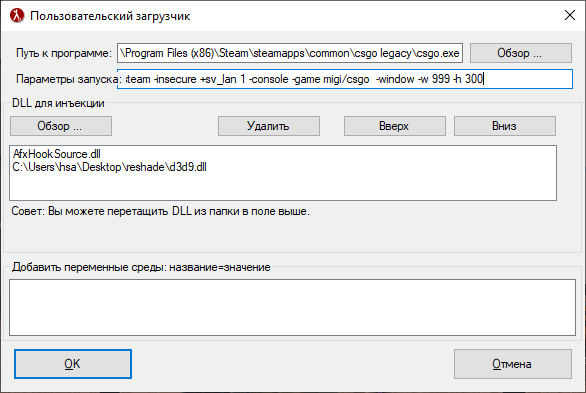
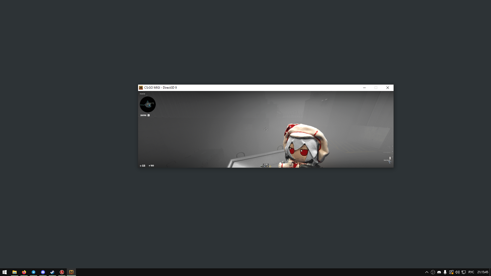

# Команды & Параметры

## Смена ника себе и ботам

* Смена боту (вместо enemy\_bot - ник боту): `mirv_replace_name filter add x enemy_bot`
* Cмена себе (после x ставим свой steamid64, вместо my\_nick ставьте свой): `mirv_replace_name filter add x7854835727182349 my_nick`

Чтобы узнать steamid64 в моём конфиге можно прописать "id" в консоль. 

<figure><figcaption></figcaption></figure> <figure><figcaption></figcaption></figure>

## HUD

* `cl_draw_only_deathnotices 0` - весь HUD включен
* `cl_draw_only_deathnotices 1` - включен только прицел и киллфид
* `cl_draw_only_deathnotices 1; cl_drawhud_force_deathnotices -1` - включен только прицел
* `cl_drawhud 0` - выключен весь HUD

<figure><figcaption>
ONLY CROSSHAIR, NO HUD, NO KILLFEED
</figcaption></figure>

## Кастомное разрешение

Есть видео-гайд как установить кастомное разрешение через панель NVIDIA/AMD/Intel:



**Но есть способ быстрее:**

1. Заходим в HLAE > Разработчик > Пользовательский загрузчик
2. Ставим в параметры запуска `-window -w [ширина] -h [высота]`, где вместо `[ширина]` и `[высота]` указываются нужные пиксели

<figure><figcaption></figcaption></figure> <figure><figcaption></figcaption></figure>


**Важное уточнение:** таким способом не получится добиться разрешения больше, чем физическое разрешение вашего монитора. Чтобы обойти это ограничение, используйте технологии **DSR (NVIDIA)** или **VSR (AMD)**. После их включения игра сможет запуститься в разрешении выше стандартного.


## Визуал

### Настройка направления теней

<figure><figcaption></figcaption></figure>



`mirv_cvar_unhide_all;`\
`cl_csm_rot_override 1;`\
`csm_quality_level 3;`\
`cl_csm_rot_x <градусы>;`\
`cl_csm_rot_y <градусы>;`\
`cl_csm_rot_z <градусы>`




* `mirv_cvar_unhide_all` — открывает доступ к скрытым консольным командам разработчиков.
* `cl_csm_rot_override 1` — включает режим ручного управления углом наклона теней.
* `csm_quality_level 3` — выставляет максимальное качество теней (Cascaded Shadow Maps).
* `cl_csm_rot_x`, `y`, `z` — задают точный угол наклона солнца по осям координат.




Вернуть всё вспять: `cl_csm_rot_override 0`


### Настройка тумана

`fogui` - Некоторые настройки влияют на наложение решейда, можно играться.

<figure><figcaption></figcaption></figure>

### Shiny Effect

<figure><figcaption></figcaption></figure> <figure><figcaption></figcaption></figure>



`mat_drawgray 1`\
`r_showenvcubemap 1`\
`mat_fullbright 2`


Включать только на низком разрешении текстур - иначе вылет.

Вводить по порядку.





* `mat_drawgray 1` — убирает все цветные текстуры, окрашивая карту в нейтральный серый цвет.
* `r_showenvcubemap 1` — заменяет материал поверхностей на зеркальный хром, отражающий скайбокс (кубмапы).
* `mat_fullbright 2` — включает максимальное освещение и переводит рендер в текстурный режим.




Вернуть всё вспять: `mat_drawgray 0; r_showenvcubemap 0; mat_fullbright 0`


### White Map Wireframe

Ставьте чёрный скайбокс, либо отключите его (r\_drawskybox 0)\
\
`mat_wireframe 2;`\
`mat_ambient_light_r -100;`\
`mat_ambient_light_b -100;`\
`mat_ambient_light_g -100;`\
`mat_fullbright 2`

<figure><figcaption></figcaption></figure>

### Окрашивание статических объектов в рандомные цвета

`r_colorstaticprops 1`

<figure><figcaption></figcaption></figure>

