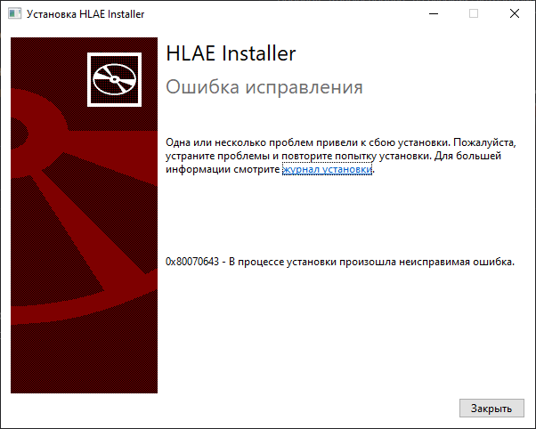
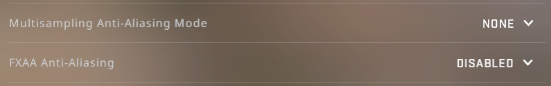
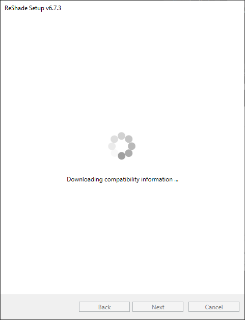

# Решение проблем

## HLAE - Ошибка 0x80070643

Часто возникает при неудавшейся попытке установки **FFMPEG** при плохом интернете или провайдер блокирует доступ к GitHub.

<figure><figcaption></figcaption></figure>

***

**Решение:** VPN / Проверить соединение с интернетом

## HLAE - Only one instance of the game can be running at one time

Скорее всего у вас в фоне запущена еще одна CS:GO, даже если её нет в панели задач.

<figure><figcaption></figcaption></figure>

***

**Решение:** Открыть диспетчер задач > Закрыть процесс `csgo.exe`

## ReShade - Не видно эффектов в игре

Часто возникает если забыли выключить Anti-Aliasing в игре, либо выключили случайно решейд на букву "Z".

***

**Решение:**


Решейд не дружит с Anti-Aliasing в игре, если его не выключить решейд может не заработать или выдавать картинку с артефактами. **ОТКЛЮЧИТЕ ЭТИ НАСТРОЙКИ:**  



## ReShade - Бесконечная загрузка эффектов в инсталлере

Часто возникает при нестабильном подключении, либо ваш провайдер блокирует доступ к GitHub.

<figure><figcaption></figcaption></figure>

***

**Решение:** VPN / Проверить соединение с интернетом

## MIGI - migi.exe Бесконечная загрузка/Белый экран

**Решение:** Установите [WebView2](https://developer.microsoft.com/en-us/microsoft-edge/webview2/)

<figure><figcaption></figcaption></figure>

## MIGI - Дикие просадки ФПС при загрузке на карту

**Решение:** При первом запуске это нормально, но если это повторяется несколько раз - запустите `migi.exe` в корне папки игры **ОТ ИМЕНИ АДМИНИСТРАТОРА** и перезапустите игру.

## MIGI - Не видно заменённых моделей

**Решение:** Запустите `migi.exe` от имени администратора и нажмите кнопку "UPDATE BUILD" для обновления MIGI, после этого есть шанс что совместимость MIGI и аддонов сойдётся.

## В папке нет записанного видео

**Решение:** Проверьте правильность написания пути сохранения видео в конфиге, переустановите FFMPEG ровно по гайду [отсюда](hlae/ustanovka.md#shag-2.-ustanovka).
